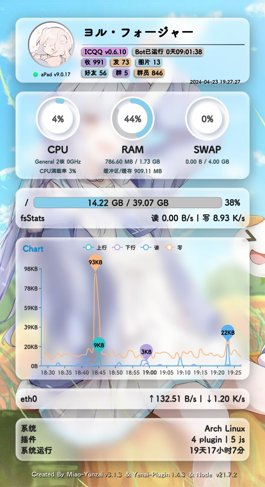
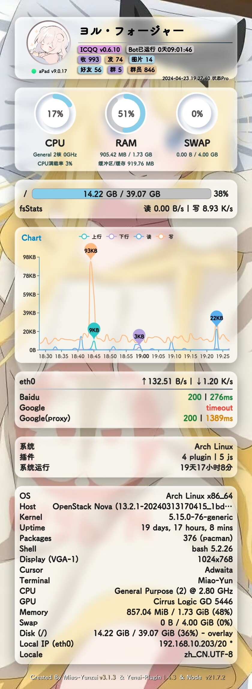

> 如果您觉得我们的项目有帮助，请给我们一个星星（Starred）！您的支持对我们非常重要，将激励我们不断改进和提供更好的内容。谢谢！🙏


<div align="left">

# Yenai-Plugin

🐑 **_Yenai-Plugin是一个Yunzai-Bot的扩展插件，提供对Bot的一些便捷操作。_**

<br><br>


[](https://github.com/yeyang52/yenai-plugin/actions/workflows/deploy-docs.yml)
[](https://vercel.com/yeyang52/yenai-plugin)
[](https://app.netlify.com/sites/yenai-plugin/deploys)

 

[](https://github.com/yeyang52/yenai-plugin/blob/master/LICENSE) 
[](https://gitmoji.dev)
[](https://gitee.com/Le-niao/Yunzai-Bot) 


[](https://gitee.com/yeyang52/yenai-plugin/stargazers)
[](https://gitee.com/yeyang52/yenai-plugin/members)
[](https://github.com/yeyang52/yenai-plugin/stargazers)
[](https://github.com/yeyang52/yenai-plugin/network)
[](https://github.com/yeyang52/yenai-plugin/issues)
</div>

<div align="center">

[](https://seladb.github.io/StarTrack-js/#/preload?r=yeyang52,yenai-plugin)

</div>

---

## 安装教程 💡

请将Yenai-Plugin放置在Yunzai-Bot的plugins目录下，重启Yunzai-Bot后即可使用。

1. 推荐使用git进行安装，以方便后续升级。在Yunzai目录打开终端，运行

- 使用github

```sh
git clone -b master --depth=1 https://github.com/yeyang52/yenai-plugin.git ./plugins/yenai-plugin
```

- 使用gitee

```sh
git clone -b master --depth=1 https://gitee.com/yeyang52/yenai-plugin.git ./plugins/yenai-plugin
```

1. 安装依赖(可选：不安装依赖将无法使用一些功能)

```sh
pnpm install
```

## 功能介绍 📖

> Yenai-Plugin为您提供以下功能
>
> Tip：以下只是简单描述功能具体指令请使用 **#椰奶帮助 #椰奶群管帮助 #椰奶设置**查看

<details>
  <summary>事件通知</summary>

- [x] 撤回监听

- [x] 好友申请

- [x] 群邀请

- [x] 好友|群 列表变动

- [x] 好友|群 消息

- [x] Bot被禁言

Tip：具体可使用 **#椰奶设置** 查看
  </details>

<details>
  <summary>助手功能</summary>

- [x] 发送 群聊|好友 消息

- [x] 改头像 | 改昵称 | 改状态 | 改昵称 | 改签名 | 改性别

- [x] 删好友 | 退群

- [x] 获取 好友|群 列表

- [x] 增 删 查 说说

- [x] 开启/关闭戳一戳

- [x] 增 删 黑/白名单


</details>
<details>
  <summary>事件处理</summary>

- [x] 同意|拒绝 好友申请

- [x] 同意|拒绝 群邀请

- [x] 回复好友消息

- [x] 查看现有好友申请/群邀请

- [x] 同意/拒绝全部好友申请/群邀请

- [x] 查看全部请求
  
- [ ] 查看/回添 单向好友
  

</details>
<details>
  <summary>娱乐功能</summary>

- [x] 随机唱鸭

- [x] 赞我（支持陌生人点赞）

- [x] coser

- [x] 支付宝到账语音

</details>
<details>
  <summary>Pixiv功能</summary>

- [x] Pixiv排行榜

- [x] Tag搜图

- [x] Pid搜图

- [x] Uid搜图

- [x] 查看热门Tag

- [x] 查看相关作品

Tip：详情请参考[此教程](https://yenai.trss.me/features/Pixiv.html)

</details>

<details>
  <summary>群管功能</summary>

- [x] (全体)?禁言|解禁

- [x] 允许|禁止 匿名

- [x] 踢@群员

- [x] 设置|取消 管理

- [x] 增 删 查 公告

- [x] 我要自闭

- [x] 申请头衔

- [x] 修改头衔

- [x] 头衔屏蔽词

- [x] 查看/清理多久没发言的人

- [x] 查看/清理从未发言的人

- [x] 查看最近入群情况

- [x] 获取禁言列表

- [x] 解除全部禁言

- [x] 加群申请处理

- [x] 白名单

- [ ] 黑名单

- [x] 哪个叼毛是龙王
  
Tip：具体可使用 **#椰奶群管帮助** 查看
  </details>

<details>
  <summary>搜图搜番</summary>

- [x] [saucenao](https://saucenao.com)
- [x] [whatanime](https://trace.moe)
- [x] [ascii2d](https://ascii2d.net)

</details>

<details>
  <summary>哔咔功能</summary>

- [x] 哔咔搜索
- [x] 哔咔看本子

</details>


<details>
  <summary>图片状态</summary>

 

 状态Pro



</details>
<br>

更多信息请移步[文档](https://yenai.trss.me)

## 特别鸣谢 ❤️

- [Yunzai-Bot](https://gitee.com/Le-niao/Yunzai-Bot)
- [cq-picsearcher-bot](https://github.com/Tsuk1ko/cq-picsearcher-bot)
- [nonebot-plugin-picstatus](https://github.com/lgc2333/nonebot-plugin-picstatus)
- [HibiAPI](https://github.com/mixmoe/HibiAPI)
- [SauceNAO](https://saucenao.com/)
- [Ascii2D](https://ascii2d.net/)
- [trace.moe](https://trace.moe) ([GitHub](https://github.com/soruly/trace.moe))
- [vilipix](https://www.vilipix.com/)
- [trss.me](https://trss.me)

### 贡献者 ✨

<!-- ALL-CONTRIBUTORS-BADGE:START - Do not remove or modify this section -->
[](#contributors-)
<!-- ALL-CONTRIBUTORS-BADGE:END -->
感谢这些了不起的人 ([emoji key](https://allcontributors.org/docs/en/emoji-key)):

<!-- ALL-CONTRIBUTORS-LIST:START - Do not remove or modify this section -->
<!-- prettier-ignore-start -->
<!-- markdownlint-disable -->
<table>
  <tbody>
    <tr>
      <td align="center" valign="top" width="14.28%"><a href="https://github.com/TimeRainStarSky"><br /><sub><b>时雨◎星空</b></sub></a><br /><a href="https://github.com/yeyang52/yenai-plugin/commits?author=TimeRainStarSky" title="Code">💻</a></td>
      <td align="center" valign="top" width="14.28%"><a href="https://github.com/Saury-loser"><br /><sub><b>花海里的秋刀鱼</b></sub></a><br /><a href="https://github.com/yeyang52/yenai-plugin/commits?author=Saury-loser" title="Code">💻</a></td>
      <td align="center" valign="top" width="14.28%"><a href="https://github.com/Georgebillion"><br /><sub><b>Georgebillion</b></sub></a><br /><a href="#ideas-Georgebillion" title="Ideas, Planning, & Feedback">🤔</a></td>
      <td align="center" valign="top" width="14.28%"><a href="https://github.com/xfdown"><br /><sub><b>小飞</b></sub></a><br /><a href="#ideas-xfdown" title="Ideas, Planning, & Feedback">🤔</a></td>
      <td align="center" valign="top" width="14.28%"><a href="https://github.com/liuzj288"><br /><sub><b>liuzj288</b></sub></a><br /><a href="https://github.com/yeyang52/yenai-plugin/commits?author=liuzj288" title="Code">💻</a></td>
      <td align="center" valign="top" width="14.28%"><a href="https://github.com/OKKOM2020"><br /><sub><b>OKKOM2020</b></sub></a><br /><a href="https://github.com/yeyang52/yenai-plugin/commits?author=OKKOM2020" title="Documentation">📖</a></td>
      <td align="center" valign="top" width="14.28%"><a href="https://github.com/kmiit"><br /><sub><b>大可鸭</b></sub></a><br /><a href="https://github.com/yeyang52/yenai-plugin/commits?author=kmiit" title="Code">💻</a></td>
    </tr>
    <tr>
      <td align="center" valign="top" width="14.28%"><a href="https://github.com/SmallK111407"><br /><sub><b>曉k</b></sub></a><br /><a href="https://github.com/yeyang52/yenai-plugin/commits?author=SmallK111407" title="Code">💻</a></td>
      <td align="center" valign="top" width="14.28%"><a href="https://github.com/ikechan8370"><br /><sub><b>ikechan8370</b></sub></a><br /><a href="https://github.com/yeyang52/yenai-plugin/commits?author=ikechan8370" title="Code">💻</a></td>
      <td align="center" valign="top" width="14.28%"><a href="https://github.com/fsqhn"><br /><sub><b>fsqhn</b></sub></a><br /><a href="https://github.com/yeyang52/yenai-plugin/commits?author=fsqhn" title="Code">💻</a></td>
      <td align="center" valign="top" width="14.28%"><a href="https://github.com/Loli-Lain"><br /><sub><b>Lain.</b></sub></a><br /><a href="https://github.com/yeyang52/yenai-plugin/commits?author=Loli-Lain" title="Code">💻</a></td>
      <td align="center" valign="top" width="14.28%"><a href="https://github.com/Denfenglai"><br /><sub><b>等风来</b></sub></a><br /><a href="https://github.com/yeyang52/yenai-plugin/commits?author=Denfenglai" title="Code">💻</a></td>
      <td align="center" valign="top" width="14.28%"><a href="https://fuxuan.org/"><br /><sub><b>Sora</b></sub></a><br /><a href="https://github.com/yeyang52/yenai-plugin/commits?author=8852690" title="Code">💻</a></td>
      <td align="center" valign="top" width="14.28%"><a href="https://github.com/batvbs"><br /><sub><b>batvbs</b></sub></a><br /><a href="https://github.com/yeyang52/yenai-plugin/commits?author=batvbs" title="Code">💻</a></td>
    </tr>
    <tr>
      <td align="center" valign="top" width="14.28%"><a href="https://github.com/ifeif"><br /><sub><b>ifeif</b></sub></a><br /><a href="https://github.com/yeyang52/yenai-plugin/commits?author=ifeif" title="Code">💻</a></td>
    </tr>
  </tbody>
</table>

<!-- markdownlint-restore -->
<!-- prettier-ignore-end -->

<!-- ALL-CONTRIBUTORS-LIST:END -->

本段遵循 [all-contributors](https://github.com/all-contributors/all-contributors) 规范，欢迎任何形式的贡献！

## 如何贡献 🤔

请查看我们的[贡献指南](CONTRIBUTING.md)，了解如何开始贡献

## 友情链接 😊

- [Yunzai-Bot插件索引](https://gitee.com/Hikari666/Yunzai-Bot-plugins-index)
- [码云镜像库](https://gitee.com/yeyang52/yenai-plugin)
- [Miao-Yunzai](https://gitee.com/yoimiya-kokomi/Miao-Yunzai)
- [TRSS-Yunzai](https://gitee.com/TimeRainStarSky/Yunzai)

## 免责声明 ❗

1. 功能仅限内部交流与小范围使用，请勿将Yunzai-Bot及Yenai-Plugin用于任何以盈利为目的的场景.
2. 图片与其他素材均来自于网络，仅供交流学习使用，如有侵权请联系，会立即删除.

## 联系方式 

🐧：746659424

💬：914247840

❤️：[打赏](https://yenai.trss.me/donate.html)


[](https://gitee.com/yeyang52/yenai-plugin)